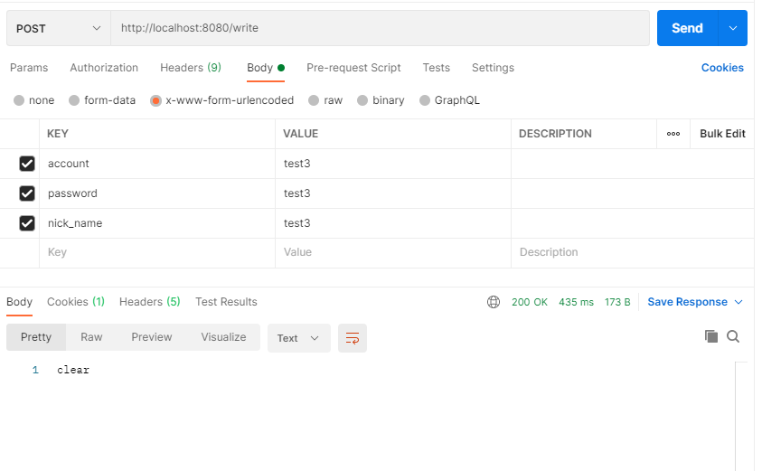

# CRUDExample
BCSD CRUD Example
예제를 '참고'하셔서 CRUD를 구현하고 그 결과를 올리시면 됩니다.

2021-05-02 POST, PATCH 입력 관련 사항  
https://www.postman.com/downloads/ 로 POSTMAN을 사용하시면 되겠습니다.  
입력은 따로 JSON을 안쓰고

위와 같이 해주시면 정상 작동 가능합니다.
